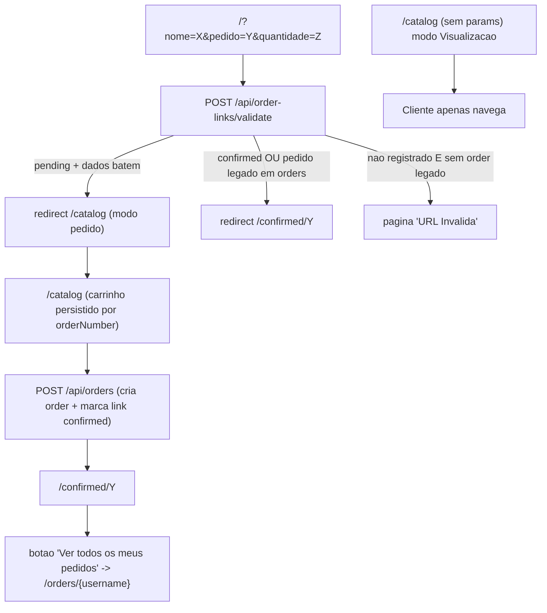

# Links de Pedidos — Refatoração

Este documento descreve as melhorias introduzidas para controlar o acesso ao
modo de pedido do catálogo por meio de **links registrados pelo admin**, sem
exigir cadastro/autenticação do cliente.

---

## Objetivos atendidos

1. **Persistência do carrinho** entre reloads e reaberturas do navegador, por pedido.
2. **Bloqueio de pedidos duplicados** e de URLs não registradas pelo admin.
3. **Página pública** onde o cliente vê todos os seus pedidos confirmados.
4. **Mover o formulário antigo da raiz** para uma aba dentro do painel admin
   ("Links de Pedidos"), exigindo autenticação e oferecendo registro de links,
   gestão da mensagem padrão e tabela com filtros.

---

## Visão geral do novo fluxo



### Modos do cliente

> **Importante:** o comportamento abaixo assume os defaults
> (`catalog_access_restricted = true`, `auto_register_links_on_confirm = false`).
> Veja "Configurações de acesso" para o efeito de cada flag.

| URL acessada                                         | Resultado                                                                                                |
| ---------------------------------------------------- | -------------------------------------------------------------------------------------------------------- |
| `/catalog`                                           | Visualização (qualquer um).                                                                              |
| `/?nome=X&pedido=Y&quantidade=Z` com link `pending`  | Redireciona para `/catalog` em modo pedido (carrinho do orderNumber `Y` é restaurado se existir).        |
| `/?nome=X&pedido=Y&quantidade=Z` com link `confirmed`| Redireciona para `/confirmed/Y` (com banner "já confirmado").                                            |
| `/?nome=X&pedido=Y&quantidade=Z` com link `cancelled`| Tela "URL Inválida" (`reason: 'cancelled'`). O link não pode mais ser reutilizado.                       |
| `/?...` sem link e sem `orders.Y`                    | Tela "URL Inválida" (apenas quando `catalog_access_restricted = true`).                                  |
| `/?...` sem link e sem `orders.Y` (restrição off)    | Redireciona para `/catalog` em modo pedido. Auto-registro pode rodar na confirmação.                     |
| `/?...` sem link mas com `orders.Y` (legado)         | Redireciona graceful para `/confirmed/Y`.                                                                |
| `/confirmed/Y`                                       | Detalhes do pedido (sempre acessível, sem precisar de link registrado).                                  |
| `/orders/{username}`                                 | Lista pública dos pedidos confirmados do cliente.                                                        |

---

## Modelo de dados

### `order_links`

| Coluna             | Tipo                          | Observações                                              |
| ------------------ | ----------------------------- | -------------------------------------------------------- |
| `id`               | `UUID PK`                     | `gen_random_uuid()`                                      |
| `customer_name`    | `TEXT NOT NULL`               | Username Shopee.                                         |
| `order_number`     | `TEXT NOT NULL UNIQUE`        | ID do pedido na Shopee.                                  |
| `quantity`         | `INTEGER NOT NULL CHECK > 0`  | Limita quantos itens o cliente pode escolher.            |
| `message`          | `TEXT`                        | Mensagem final, com `{{link gerado}}` substituído.       |
| `message_template` | `TEXT`                        | Template original (com placeholder).                     |
| `generated_url`    | `TEXT NOT NULL`               | URL pronta para enviar ao cliente.                       |
| `status`           | `TEXT NOT NULL DEFAULT 'pending'` | `'pending' \| 'confirmed' \| 'cancelled'`             |
| `created_at`       | `TIMESTAMPTZ DEFAULT NOW()`   |                                                          |
| `updated_at`       | `TIMESTAMPTZ DEFAULT NOW()`   |                                                          |
| `confirmed_at`     | `TIMESTAMPTZ`                 | Preenchido quando o pedido é criado.                     |
| `order_id`         | `UUID FK -> orders(id)`       | `ON DELETE SET NULL`.                                    |

Índices: `idx_order_links_status (status)`, `idx_order_links_customer (customer_name)`.

### `app_settings`

| Coluna       | Tipo                        | Observações                            |
| ------------ | --------------------------- | -------------------------------------- |
| `key`        | `TEXT PK`                   |                                        |
| `value`      | `TEXT`                      |                                        |
| `updated_at` | `TIMESTAMPTZ DEFAULT NOW()` |                                        |

Seed inicial:
```
key   = 'default_link_message'
value = 'Olá! Aqui está o link para escolher os itens do seu pedido na nossa galeria: {{link}}'
```

> **Marcador da mensagem:** o token oficial é `{{link}}`. O legado
> `{{link gerado}}` continua sendo aceito pelo backend e pela
> pré-visualização da UI (regex `/{{\\s*link(?:\\s+gerado)?\\s*}}/gi`),
> garantindo que mensagens já enviadas não quebrem.

#### Flags adicionais (sem migração obrigatória)

As duas chaves abaixo são lidas do mesmo `app_settings`, mas **não** são
seedadas: o servidor aplica defaults quando ausentes, garantindo que o
comportamento atual seja preservado caso a chave ainda não exista.

| Chave                              | Default | Significado                                                                            |
| ---------------------------------- | ------- | -------------------------------------------------------------------------------------- |
| `catalog_access_restricted`        | `true`  | Quando `true`, apenas links registrados podem entrar em modo pedido.                   |
| `auto_register_links_on_confirm`   | `false` | Quando `true` **e** restrição estiver desligada, pedidos confirmados sem link prévio   |
|                                    |         | criam automaticamente um `order_link` com status `confirmed` na mesma transação.       |

Regra defensiva: o backend força `auto_register_links_on_confirm = false`
quando `catalog_access_restricted = true` (a opção secundária só faz
sentido com a restrição desligada).

### Como aplicar a migração

Na primeira subida em produção, é preciso garantir as duas tabelas:

- **Opção 1 (UI):** clique em "Inicializar Banco de Dados" na tela de erro do
  admin (ou faça `POST /api/init-db`). O endpoint é idempotente.
- **Opção 2 (pgAdmin):** rode o SQL abaixo:

```sql
CREATE EXTENSION IF NOT EXISTS pgcrypto;

CREATE TABLE IF NOT EXISTS order_links (
  id UUID DEFAULT gen_random_uuid() PRIMARY KEY,
  customer_name    TEXT NOT NULL,
  order_number     TEXT NOT NULL UNIQUE,
  quantity         INTEGER NOT NULL CHECK (quantity > 0),
  message          TEXT,
  message_template TEXT,
  generated_url    TEXT NOT NULL,
  status           TEXT NOT NULL DEFAULT 'pending',
  created_at       TIMESTAMP WITH TIME ZONE DEFAULT NOW(),
  updated_at       TIMESTAMP WITH TIME ZONE DEFAULT NOW(),
  confirmed_at     TIMESTAMP WITH TIME ZONE,
  order_id         UUID REFERENCES orders(id) ON DELETE SET NULL
);
CREATE INDEX IF NOT EXISTS idx_order_links_status   ON order_links(status);
CREATE INDEX IF NOT EXISTS idx_order_links_customer ON order_links(customer_name);

CREATE TABLE IF NOT EXISTS app_settings (
  key        TEXT PRIMARY KEY,
  value      TEXT,
  updated_at TIMESTAMP WITH TIME ZONE DEFAULT NOW()
);

INSERT INTO app_settings(key, value)
VALUES (
  'default_link_message',
  'Olá! Aqui está o link para escolher os itens do seu pedido na nossa galeria: {{link}}'
)
ON CONFLICT (key) DO NOTHING;
```

---

## API

### Públicas

| Método | Rota                                  | Descrição                                                                                                 |
| ------ | ------------------------------------- | --------------------------------------------------------------------------------------------------------- |
| `POST` | `/api/order-links/validate`           | Body `{ name, orderNumber, quantity }`. Retorna `{ result: 'allowed' \| 'confirmed' \| 'invalid' }`.      |
| `GET`  | `/api/orders/by-customer?name=...`    | Lista os pedidos confirmados (não cancelados) do cliente. Não retorna `whatsapp_message`.                 |
| `POST` | `/api/orders`                         | Já existia. Agora valida contra `order_links` e atualiza o link na mesma transação (BEGIN/COMMIT/ROLLBACK).|

### Autenticadas (admin)

| Método | Rota                                | Descrição                                                                                       |
| ------ | ----------------------------------- | ----------------------------------------------------------------------------------------------- |
| `POST` | `/api/order-links`                  | Cria um link novo (quantidade livre entre 1 e 999).                                             |
| `GET`  | `/api/order-links`                  | Lista paginada com filtros (status `pending`/`confirmed`/`cancelled`, período, busca).          |
| `PATCH`| `/api/order-links/{id}`             | Body `{ action: 'cancel' }`. Cancela manualmente um link com status `pending`.                  |
| `GET`  | `/api/settings/link-message`        | Lê o template padrão da mensagem.                                                               |
| `PUT`  | `/api/settings/link-message`        | Atualiza o template padrão (até 5000 caracteres).                                               |
| `GET`  | `/api/settings/access-control`      | Lê as flags `catalog_access_restricted` e `auto_register_links_on_confirm`.                     |
| `PUT`  | `/api/settings/access-control`      | Atualiza ambas as flags (aceita body parcial). Aplica a regra defensiva `auto=false` quando     |
|        |                                     | `restricted=true` antes de persistir.                                                           |

Resposta típica de `POST /api/order-links/validate`:

```json
{ "result": "allowed" }
{ "result": "allowed", "reason": "unrestricted" }
{ "result": "confirmed", "legacy": true }
{ "result": "invalid", "reason": "not_registered" }
{ "result": "invalid", "reason": "cancelled" }
{ "result": "invalid", "reason": "mismatch" }
```

> `{ "result": "allowed", "reason": "unrestricted" }` só ocorre quando o
> admin desligou `catalog_access_restricted`. Nesse caso, links não
> registrados também passam para `/catalog` em modo pedido.

---

## Front-end

### Cliente

- **`app/page.tsx`** — agora é apenas validador/redirecionador. Sem
  formulário. Sem params, redireciona para `/catalog`. Com params válidos,
  grava `customerData` em localStorage, preserva o carrinho do mesmo
  `orderNumber` e redireciona para `/catalog`. Renderiza inline a tela
  "URL Inválida" (logo + ícone de link quebrado) quando o link não é válido.
- **`app/catalog/page.tsx`**
  - Carrinho keyado por `selectedImages:{orderNumber}`.
  - Cronômetro keyado por `catalogTimer:{orderNumber}` (com migração suave
    do timer global anterior).
  - Validação em background contra `/api/order-links/validate`: se o link
    estiver `confirmed`, redireciona para `/confirmed/{orderNumber}`; se
    `invalid`, limpa sessão e volta para `/`.
  - Antes do redirect para `/confirmed`, grava
    `localStorage.setItem("justConfirmed:{orderNumber}", "1")` para
    sinalizar a primeira visita.
- **`app/confirmed/[orderNumber]/page.tsx`**
  - Banner amarelo destacado no topo: *"Este pedido já foi confirmado e não
    pode ser alterado. Data da confirmação: dd/mm/aaaa, HH:mmh"* (pt-BR).
    O banner aparece apenas em revisitas (não na primeira visita após
    confirmar).
  - Botão **"Ver todos os meus pedidos"** → `/orders/{customer_name}`.
  - Resolução de URLs de imagens via util compartilhada (`lib/image-urls.ts`).
- **`app/orders/[username]/page.tsx`** *(novo)* — lista pública dos pedidos
  confirmados, com modal "Ver itens" no mesmo estilo do modal de
  confirmação do `/catalog` (grade de miniaturas com contador `Nx`).

### Admin

- **`app/admin/layout.tsx`** — nova aba **"Links de Pedidos"** entre
  Dashboard e Histórico de produção (ícone `Link2`).
- **`app/admin/links/page.tsx`** *(novo)* — organizado em:
  1. **Topo da aba**: título à esquerda; à direita, dois botões — **"Mensagem
     padrão"** abre o modal homônimo e **engrenagem** (`Settings`) abre o
     modal **"Configurações de acesso"**.
  2. **Modal "Mensagem padrão"**: textarea com hint sobre o placeholder
     `{{link gerado}}` + botões Cancelar/Salvar. Ao salvar com sucesso o
     modal fecha automaticamente.
  3. **Modal "Configurações de acesso"** *(novo)*:
     - `Switch` principal: **"Restringir acesso ao catálogo (modo pedido)"**
       liga/desliga `catalog_access_restricted`.
     - `Switch` secundário, exibido apenas quando o principal está
       desligado: **"Registrar links automaticamente ao confirmar pedido"**
       controla `auto_register_links_on_confirm`. Quando o principal volta a
       ser ligado, o secundário é forçado a `false` (UI + backend).
  4. **Novo link**: Nome (username Shopee), Pedido, Quantidade
     (`Input type="number"` aceitando 1–999), campo "Link gerado"
     (preenchido em tempo real e copiável; usa apenas `origin` da base, sem
     sub-paths), textarea "Mensagem" com placeholder `{{link}}` (legado
     `{{link gerado}}` ainda aceito) e botão **Registrar Link**.
  5. **Modal de sucesso**: exibe URL e mensagem (com quebras de linha) e
     oferece copiar link / copiar mensagem.
  6. **Filtros** — `Status` (`Pendentes`, `Confirmados`, `Cancelados`) em
     uma linha; `Período` (campo + duas datas + ações) e **Busca** (input +
     ações) lado a lado em uma segunda linha.
  7. **Lista** paginada — mesmo padrão visual da tabela do Dashboard.
     Cada linha pendente exibe um botão **Cancelar** (ícone `Ban`) que abre
     um modal de confirmação. Links já confirmados ou cancelados não
     mostram o botão.
  8. **Modal de cancelamento**: confirma a operação exibindo Cliente,
     Pedido e Quantidade. Ao confirmar, chama `PATCH /api/order-links/{id}`
     com `{ action: 'cancel' }` e atualiza a lista.

---

## Componentes utilitários novos

- **[`lib/order-links.ts`](lib/order-links.ts)** — `buildClientOrderLink()`
  centraliza a montagem de
  `${NEXT_PUBLIC_BASE_URL}/?nome=...&pedido=...&quantidade=...`.
- **[`lib/image-urls.ts`](lib/image-urls.ts)** — `resolveImageUrls(codes)`
  reutilizada pelas páginas `/confirmed/[orderNumber]` e
  `/orders/[username]`. Possui fallback para `/api/images?code=...` e
  placeholder único `PLACEHOLDER_IMAGE_URL`.
- **`createOrderWithLinkConfirmation(order, options?)`** em
  [`lib/database.ts`](lib/database.ts) — abre transação,
  trava o link com `FOR UPDATE`, valida `customer_name`/`quantity`, insere
  o pedido e atualiza o link para `confirmed` em uma única operação.
  Mantém compatibilidade com pedidos legados (sem link registrado).
  Aceita `options.autoRegister = { generatedUrl }`: quando fornecido **e**
  não existir link prévio, cria dentro da mesma transação um `order_link`
  com status `confirmed`. O `INSERT` usa `ON CONFLICT (order_number) DO NOTHING`
  para tratar corridas como no-op (o pedido é criado mesmo assim).
- **`getAppSettingBoolean(key, defaultValue)`** em
  [`lib/database.ts`](lib/database.ts) — lê uma chave booleana de
  `app_settings`, com fallback robusto para o default quando ausente ou
  inválida. Usado pelos endpoints de validação e criação de pedido.

---

## Estratégia de chaves no `localStorage`

| Chave                                  | Conteúdo                                              | Limpeza                                          |
| -------------------------------------- | ----------------------------------------------------- | ------------------------------------------------ |
| `customerData`                         | `{ name, orderNumber, quantity, timestamp }`          | Após confirmar pedido / link inválido.           |
| `sessionLocked`                        | `"true"` enquanto há `customerData`.                  | Após confirmar pedido / link inválido.           |
| `selectedImages:{orderNumber}`         | Carrinho do pedido em andamento.                      | Após confirmar pedido / troca de orderNumber.    |
| `catalogTimer:{orderNumber}`           | Epoch (segundos) do fim do timer de 2h.               | Após confirmar pedido / troca de orderNumber.    |
| `imageCache:{orderNumber}`             | Cache local de URLs de imagens vistas.                | Após confirmar pedido / troca de orderNumber.    |
| `justConfirmed:{orderNumber}`          | Flag `"1"` que suprime o banner "já confirmado" na    | É consumida (removida) na primeira visita        |
|                                        | primeira visita ao `/confirmed/{orderNumber}`.        | ao `/confirmed/{orderNumber}`.                   |

---

## Configurações de acesso

A aba `/admin/links` expõe dois switches no modal **Configurações de
acesso**, persistidos em `app_settings` via `PUT /api/settings/access-control`.

| Cenário                                                       | `restricted` | `auto_register` | Comportamento                                                                                                             |
| ------------------------------------------------------------- | ------------ | --------------- | ------------------------------------------------------------------------------------------------------------------------- |
| Default (estado atual antes da feature)                       | `true`       | `false`         | Apenas links registrados acessam modo pedido. URLs não registradas mostram "URL Inválida".                                |
| Restrição desligada, sem auto-registro                        | `false`      | `false`         | Qualquer URL com `nome/pedido/quantidade` válida vai para `/catalog`. Pedido criado, mas `order_links` NÃO recebe entrada.|
| Restrição desligada, com auto-registro                        | `false`      | `true`          | Igual ao anterior + ao confirmar o pedido, o link é registrado automaticamente como `confirmed` (UNIQUE protege corrida). |
| Tentativa de ligar restrição com auto-registro ativo          | `true`       | (forçado para `false`) | O backend coage `auto_register=false` no PUT (UI replica a coerção).                                              |

Em todos os cenários, links já registrados como `pending` continuam
sendo validados normalmente: mismatch de nome/quantidade ainda retorna
`{ result: 'invalid', reason: 'mismatch' }` para preservar a integridade
dos links efetivamente registrados.

---

## Cancelamento de links

Existem dois caminhos para um link chegar ao status `cancelled`:

1. **Manual no admin**, via botão **Cancelar** na lista de `/admin/links`.
   - Disponível **apenas** para links com status `pending`. Links já
     `confirmed` não exibem o botão (a operação só faz sentido cancelando
     o pedido associado em `/orders`).
   - Endpoint: `PATCH /api/order-links/{id}` com `{ action: 'cancel' }`.
2. **Automático ao cancelar o pedido em `/orders`**.
   - `cancelOrder(id)` agora roda em transação: além do `UPDATE orders SET
     canceled_at = NOW()`, executa
     `UPDATE order_links SET status='cancelled' WHERE order_id = $1 AND
     status <> 'cancelled'`. Idempotente e no-op quando o pedido nunca
     teve link associado (ex.: cenário legacy).

Efeitos em downstream:

- `POST /api/order-links/validate` retorna `{ result: 'invalid', reason:
  'cancelled' }` quando o cliente tenta reabrir o link cancelado → tela
  "URL Inválida" no `/`.
- `createOrderWithLinkConfirmation` rejeita explicitamente links
  `cancelled` com erro amigável (HTTP 400 em `POST /api/orders`),
  evitando que `localStorage` contaminado consiga forçar a criação de um
  pedido para um link cancelado.

---

## Compatibilidade com pedidos antigos

- Pedidos confirmados **antes** desta refatoração permanecem acessíveis em
  `/confirmed/{orderNumber}` sem alterações.
- URLs antigas no formato `/?nome=...&pedido=...&quantidade=...`:
  - Se o `pedido` existe em `orders` (legado): redireciona para
    `/confirmed/{orderNumber}` (banner "já confirmado").
  - Caso contrário: tela "URL Inválida".

---

## Riscos & considerações

- A migração precisa ser executada uma única vez em produção (ver seção
  "Como aplicar a migração"). Sem ela, os endpoints novos retornam 500.
- `POST /api/order-links/validate` é público; expõe apenas existência de um
  link/pedido, não dados. Caso o volume cresça, considerar rate-limit.
- `GET /api/orders/by-customer` é público (decisão validada com o usuário).
  Não retorna `whatsapp_message` nem campos sensíveis.
- O timer de 2h continua puramente client-side (visual), agora keyado por
  pedido. Não impede confirmação no servidor.
- O backend revalida tudo na hora de criar o pedido
  (`createOrderWithLinkConfirmation`), portanto qualquer manipulação de
  `localStorage` no cliente é rejeitada com erro amigável.

---

## Cenários sugeridos para QA manual

1. `/catalog` sem params → modo visualização (sem cronômetro / sem botão
   confirmar).
2. Admin registra um link → recebe modal com URL e mensagem; tabela mostra
   o link como `pending`.
3. Cliente abre o link → vai para `/catalog` em modo pedido. Seleciona
   itens, recarrega → seleção persiste. Fecha e reabre via mesma URL → a
   seleção continua.
4. Cliente confirma → vai para `/confirmed/X` sem banner.
5. Cliente reabre o mesmo link → a raiz redireciona para `/confirmed/X`
   com banner destacado.
6. Cliente clica "Ver todos os meus pedidos" → vê listagem em
   `/orders/{username}` com modal "Ver itens".
7. Cliente abre URL com `pedido=NAOEXISTE` → tela "URL Inválida"
   (defaults: restrição ligada).
8. Pedido legado: URL com params para um `pedido` antigo → redirect
   graceful para `/confirmed/{orderNumber}`.
9. Admin tenta registrar link com `pedido` já existente → erro amigável.
10. Tentativa de bypass: forçar `customerData` no localStorage e abrir
    `/catalog` → validação em background redireciona; se passar, o servidor
    rejeita o `POST /api/orders`.

### Cenários adicionais para "Configurações de acesso"

11. Admin desliga **"Restringir acesso ao catálogo"** → switch secundário
    aparece. Cliente abre `/?nome=X&pedido=Y&quantidade=Z` sem link prévio
    → vai para `/catalog` em modo pedido normalmente.
12. Mesma situação do 11 + admin liga **"Registrar links automaticamente"**
    → cliente confirma o pedido → tabela em `/admin/links` passa a exibir
    o link como `confirmed` (criado pela transação).
13. Cenário 11 sem o auto-registro → cliente confirma, pedido é criado,
    mas a tabela de links continua vazia (modo legacy preservado).
14. Admin liga novamente "Restrição" enquanto o auto-registro estava ativo
    → backend força `auto_register_links_on_confirm=false`. `GET
    /api/settings/access-control` confirma o novo estado.
15. Link `pending` registrado + restrição desligada → cliente tenta
    burlar com `nome` ou `quantidade` diferentes do registrado → resposta
    `{ result: 'invalid', reason: 'mismatch' }` (proteção mantida).
16. Concorrência: dois browsers confirmam o mesmo `order_number` em
    paralelo (com auto-registro ligado) → apenas um pedido é criado
    (UNIQUE em `orders.order`); o outro recebe erro amigável; nenhum link
    duplicado é gerado.
17. Layout: `/admin/links` mostra `Status` na linha 1 e `Período` + `Busca`
    lado a lado na linha 2 (em telas estreitas, empilham verticalmente).

### Cenários adicionais para cancelamento

18. Admin clica **Cancelar** em um link `pending` → modal de confirmação
    aparece com Cliente/Pedido/Quantidade → confirma → tabela mostra o
    badge vermelho "Cancelado". O botão Cancelar some.
19. Cliente reabre a URL de um link `cancelled` → tela "URL Inválida"
    (`reason: cancelled`). Tentativa de bypass via `localStorage` ainda
    falha em `POST /api/orders` (mensagem "Este link foi cancelado").
20. Admin cancela o pedido associado em `/orders` → na próxima atualização
    da lista de `/admin/links`, o link aparece como `cancelled` (mesmo
    quando estava `confirmed`). Pedidos legados (sem link) não geram nada
    novo (no-op).
21. Filtro: marcar apenas "Cancelados" mostra somente os links cancelados
    (manuais + automáticos). Desmarcar todos é bloqueado pela UI.
22. Link gerado: `NEXT_PUBLIC_BASE_URL=https://catalogo.lojacenario.com.br/catalogointerativo`
    produz `https://catalogo.lojacenario.com.br/?nome=...&pedido=...&quantidade=...`
    (descarta o sub-path).
