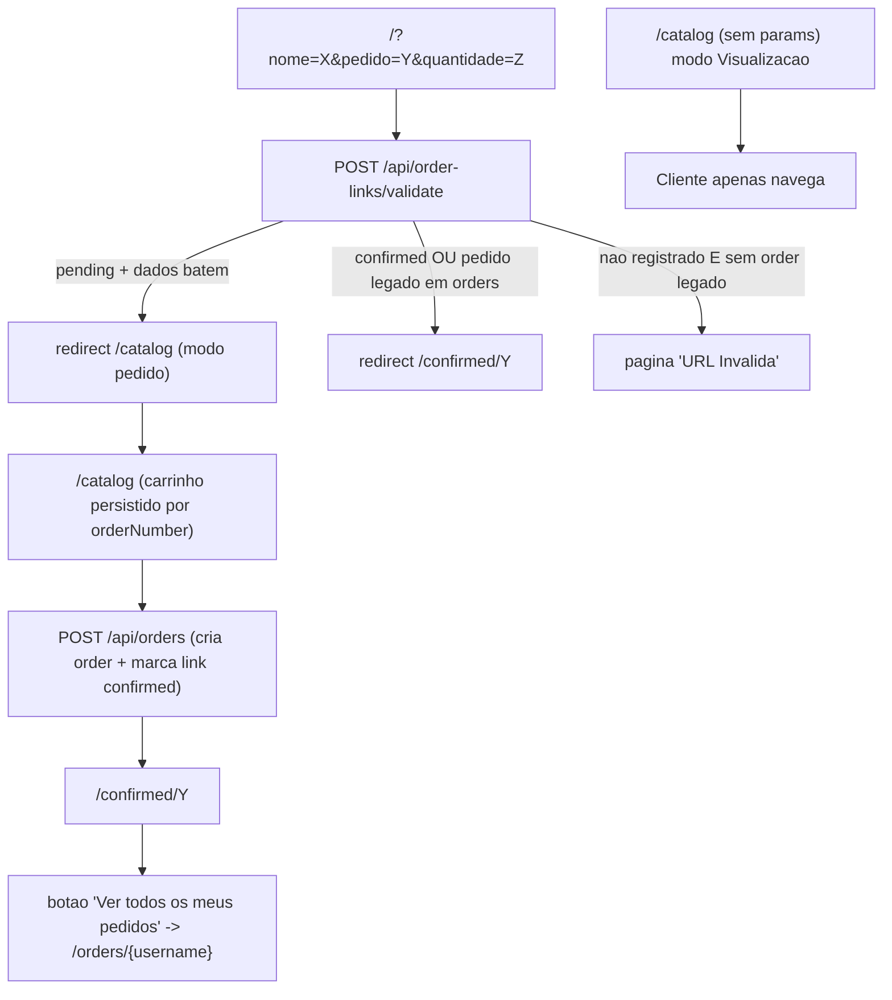

# Links de Pedidos — Refatoração

Este documento descreve as melhorias introduzidas para controlar o acesso ao
modo de pedido do catálogo por meio de **links registrados pelo admin**, sem
exigir cadastro/autenticação do cliente.

---

## Objetivos atendidos

1. **Persistência do carrinho** entre reloads e reaberturas do navegador, por pedido.
2. **Bloqueio de pedidos duplicados** e de URLs não registradas pelo admin.
3. **Página pública** onde o cliente vê todos os seus pedidos confirmados.
4. **Mover o formulário antigo da raiz** para uma aba dentro do painel admin
   ("Links de Pedidos"), exigindo autenticação e oferecendo registro de links,
   gestão da mensagem padrão e tabela com filtros.

---

## Visão geral do novo fluxo



### Modos do cliente

| URL acessada                                         | Resultado                                                                                                |
| ---------------------------------------------------- | -------------------------------------------------------------------------------------------------------- |
| `/catalog`                                           | Visualização (qualquer um).                                                                              |
| `/?nome=X&pedido=Y&quantidade=Z` com link `pending`  | Redireciona para `/catalog` em modo pedido (carrinho do orderNumber `Y` é restaurado se existir).        |
| `/?nome=X&pedido=Y&quantidade=Z` com link `confirmed`| Redireciona para `/confirmed/Y` (com banner "já confirmado").                                            |
| `/?...` sem link e sem `orders.Y`                    | Tela "URL Inválida".                                                                                     |
| `/?...` sem link mas com `orders.Y` (legado)         | Redireciona graceful para `/confirmed/Y`.                                                                |
| `/confirmed/Y`                                       | Detalhes do pedido (sempre acessível, sem precisar de link registrado).                                  |
| `/orders/{username}`                                 | Lista pública dos pedidos confirmados do cliente.                                                        |

---

## Modelo de dados

### `order_links`

| Coluna             | Tipo                          | Observações                                              |
| ------------------ | ----------------------------- | -------------------------------------------------------- |
| `id`               | `UUID PK`                     | `gen_random_uuid()`                                      |
| `customer_name`    | `TEXT NOT NULL`               | Username Shopee.                                         |
| `order_number`     | `TEXT NOT NULL UNIQUE`        | ID do pedido na Shopee.                                  |
| `quantity`         | `INTEGER NOT NULL CHECK > 0`  | Limita quantos itens o cliente pode escolher.            |
| `message`          | `TEXT`                        | Mensagem final, com `{{link gerado}}` substituído.       |
| `message_template` | `TEXT`                        | Template original (com placeholder).                     |
| `generated_url`    | `TEXT NOT NULL`               | URL pronta para enviar ao cliente.                       |
| `status`           | `TEXT NOT NULL DEFAULT 'pending'` | `'pending' \| 'confirmed'`                            |
| `created_at`       | `TIMESTAMPTZ DEFAULT NOW()`   |                                                          |
| `updated_at`       | `TIMESTAMPTZ DEFAULT NOW()`   |                                                          |
| `confirmed_at`     | `TIMESTAMPTZ`                 | Preenchido quando o pedido é criado.                     |
| `order_id`         | `UUID FK -> orders(id)`       | `ON DELETE SET NULL`.                                    |

Índices: `idx_order_links_status (status)`, `idx_order_links_customer (customer_name)`.

### `app_settings`

| Coluna       | Tipo                        | Observações                            |
| ------------ | --------------------------- | -------------------------------------- |
| `key`        | `TEXT PK`                   |                                        |
| `value`      | `TEXT`                      |                                        |
| `updated_at` | `TIMESTAMPTZ DEFAULT NOW()` |                                        |

Seed inicial:
```
key   = 'default_link_message'
value = 'Olá! Aqui está o link para escolher os itens do seu pedido na nossa galeria: {{link gerado}}'
```

### Como aplicar a migração

Na primeira subida em produção, é preciso garantir as duas tabelas:

- **Opção 1 (UI):** clique em "Inicializar Banco de Dados" na tela de erro do
  admin (ou faça `POST /api/init-db`). O endpoint é idempotente.
- **Opção 2 (pgAdmin):** rode o SQL abaixo:

```sql
CREATE EXTENSION IF NOT EXISTS pgcrypto;

CREATE TABLE IF NOT EXISTS order_links (
  id UUID DEFAULT gen_random_uuid() PRIMARY KEY,
  customer_name    TEXT NOT NULL,
  order_number     TEXT NOT NULL UNIQUE,
  quantity         INTEGER NOT NULL CHECK (quantity > 0),
  message          TEXT,
  message_template TEXT,
  generated_url    TEXT NOT NULL,
  status           TEXT NOT NULL DEFAULT 'pending',
  created_at       TIMESTAMP WITH TIME ZONE DEFAULT NOW(),
  updated_at       TIMESTAMP WITH TIME ZONE DEFAULT NOW(),
  confirmed_at     TIMESTAMP WITH TIME ZONE,
  order_id         UUID REFERENCES orders(id) ON DELETE SET NULL
);
CREATE INDEX IF NOT EXISTS idx_order_links_status   ON order_links(status);
CREATE INDEX IF NOT EXISTS idx_order_links_customer ON order_links(customer_name);

CREATE TABLE IF NOT EXISTS app_settings (
  key        TEXT PRIMARY KEY,
  value      TEXT,
  updated_at TIMESTAMP WITH TIME ZONE DEFAULT NOW()
);

INSERT INTO app_settings(key, value)
VALUES (
  'default_link_message',
  'Olá! Aqui está o link para escolher os itens do seu pedido na nossa galeria: {{link gerado}}'
)
ON CONFLICT (key) DO NOTHING;
```

---

## API

### Públicas

| Método | Rota                                  | Descrição                                                                                                 |
| ------ | ------------------------------------- | --------------------------------------------------------------------------------------------------------- |
| `POST` | `/api/order-links/validate`           | Body `{ name, orderNumber, quantity }`. Retorna `{ result: 'allowed' \| 'confirmed' \| 'invalid' }`.      |
| `GET`  | `/api/orders/by-customer?name=...`    | Lista os pedidos confirmados (não cancelados) do cliente. Não retorna `whatsapp_message`.                 |
| `POST` | `/api/orders`                         | Já existia. Agora valida contra `order_links` e atualiza o link na mesma transação (BEGIN/COMMIT/ROLLBACK).|

### Autenticadas (admin)

| Método | Rota                                | Descrição                                                                                       |
| ------ | ----------------------------------- | ----------------------------------------------------------------------------------------------- |
| `POST` | `/api/order-links`                  | Cria um link novo (valida quantity em `MEASURE_BY_QUANTITY`).                                   |
| `GET`  | `/api/order-links`                  | Lista paginada com filtros (status, período `created`/`confirmed`, busca por nome/pedido).      |
| `GET`  | `/api/settings/link-message`        | Lê o template padrão da mensagem.                                                               |
| `PUT`  | `/api/settings/link-message`        | Atualiza o template padrão (até 5000 caracteres).                                               |

Resposta típica de `POST /api/order-links/validate`:

```json
{ "result": "allowed" }
{ "result": "confirmed", "legacy": true }
{ "result": "invalid", "reason": "not_registered" }
```

---

## Front-end

### Cliente

- **`app/page.tsx`** — agora é apenas validador/redirecionador. Sem
  formulário. Sem params, redireciona para `/catalog`. Com params válidos,
  grava `customerData` em localStorage, preserva o carrinho do mesmo
  `orderNumber` e redireciona para `/catalog`. Renderiza inline a tela
  "URL Inválida" (logo + ícone de link quebrado) quando o link não é válido.
- **`app/catalog/page.tsx`**
  - Carrinho keyado por `selectedImages:{orderNumber}`.
  - Cronômetro keyado por `catalogTimer:{orderNumber}` (com migração suave
    do timer global anterior).
  - Validação em background contra `/api/order-links/validate`: se o link
    estiver `confirmed`, redireciona para `/confirmed/{orderNumber}`; se
    `invalid`, limpa sessão e volta para `/`.
  - Antes do redirect para `/confirmed`, grava
    `localStorage.setItem("justConfirmed:{orderNumber}", "1")` para
    sinalizar a primeira visita.
- **`app/confirmed/[orderNumber]/page.tsx`**
  - Banner amarelo destacado no topo: *"Este pedido já foi confirmado e não
    pode ser alterado. Data da confirmação: dd/mm/aaaa, HH:mmh"* (pt-BR).
    O banner aparece apenas em revisitas (não na primeira visita após
    confirmar).
  - Botão **"Ver todos os meus pedidos"** → `/orders/{customer_name}`.
  - Resolução de URLs de imagens via util compartilhada (`lib/image-urls.ts`).
- **`app/orders/[username]/page.tsx`** *(novo)* — lista pública dos pedidos
  confirmados, com modal "Ver itens" no mesmo estilo do modal de
  confirmação do `/catalog` (grade de miniaturas com contador `Nx`).

### Admin

- **`app/admin/layout.tsx`** — nova aba **"Links de Pedidos"** entre
  Dashboard e Histórico de produção (ícone `Link2`).
- **`app/admin/links/page.tsx`** *(novo)* — três áreas:
  1. **Mensagem padrão** com textarea, hint sobre o placeholder
     `{{link gerado}}` e botão Salvar.
  2. **Novo link**: Nome (username Shopee), Pedido, Quantidade
     (Select limitado a `MEASURE_BY_QUANTITY`), campo "Link gerado"
     (preenchido em tempo real e copiável), textarea "Mensagem"
     (inicializa com o template, com pré-visualização) e botão **Registrar Link**.
  3. **Modal de sucesso**: exibe URL e mensagem (com quebras de linha) e
     oferece copiar link / copiar mensagem.
  4. **Lista** paginada com filtros (status, período `created`/`confirmed`,
     busca por nome/pedido) — mesmo padrão visual da tabela do Dashboard.

---

## Componentes utilitários novos

- **[`lib/order-links.ts`](lib/order-links.ts)** — `buildClientOrderLink()`
  centraliza a montagem de
  `${NEXT_PUBLIC_BASE_URL}/?nome=...&pedido=...&quantidade=...`.
- **[`lib/image-urls.ts`](lib/image-urls.ts)** — `resolveImageUrls(codes)`
  reutilizada pelas páginas `/confirmed/[orderNumber]` e
  `/orders/[username]`. Possui fallback para `/api/images?code=...` e
  placeholder único `PLACEHOLDER_IMAGE_URL`.
- **`createOrderWithLinkConfirmation()`** em
  [`lib/database.ts`](lib/database.ts) — abre transação,
  trava o link com `FOR UPDATE`, valida `customer_name`/`quantity`, insere
  o pedido e atualiza o link para `confirmed` em uma única operação.
  Mantém compatibilidade com pedidos legados (sem link registrado).

---

## Estratégia de chaves no `localStorage`

| Chave                                  | Conteúdo                                              | Limpeza                                          |
| -------------------------------------- | ----------------------------------------------------- | ------------------------------------------------ |
| `customerData`                         | `{ name, orderNumber, quantity, timestamp }`          | Após confirmar pedido / link inválido.           |
| `sessionLocked`                        | `"true"` enquanto há `customerData`.                  | Após confirmar pedido / link inválido.           |
| `selectedImages:{orderNumber}`         | Carrinho do pedido em andamento.                      | Após confirmar pedido / troca de orderNumber.    |
| `catalogTimer:{orderNumber}`           | Epoch (segundos) do fim do timer de 2h.               | Após confirmar pedido / troca de orderNumber.    |
| `imageCache:{orderNumber}`             | Cache local de URLs de imagens vistas.                | Após confirmar pedido / troca de orderNumber.    |
| `justConfirmed:{orderNumber}`          | Flag `"1"` que suprime o banner "já confirmado" na    | É consumida (removida) na primeira visita        |
|                                        | primeira visita ao `/confirmed/{orderNumber}`.        | ao `/confirmed/{orderNumber}`.                   |

---

## Compatibilidade com pedidos antigos

- Pedidos confirmados **antes** desta refatoração permanecem acessíveis em
  `/confirmed/{orderNumber}` sem alterações.
- URLs antigas no formato `/?nome=...&pedido=...&quantidade=...`:
  - Se o `pedido` existe em `orders` (legado): redireciona para
    `/confirmed/{orderNumber}` (banner "já confirmado").
  - Caso contrário: tela "URL Inválida".

---

## Riscos & considerações

- A migração precisa ser executada uma única vez em produção (ver seção
  "Como aplicar a migração"). Sem ela, os endpoints novos retornam 500.
- `POST /api/order-links/validate` é público; expõe apenas existência de um
  link/pedido, não dados. Caso o volume cresça, considerar rate-limit.
- `GET /api/orders/by-customer` é público (decisão validada com o usuário).
  Não retorna `whatsapp_message` nem campos sensíveis.
- O timer de 2h continua puramente client-side (visual), agora keyado por
  pedido. Não impede confirmação no servidor.
- O backend revalida tudo na hora de criar o pedido
  (`createOrderWithLinkConfirmation`), portanto qualquer manipulação de
  `localStorage` no cliente é rejeitada com erro amigável.

---

## Cenários sugeridos para QA manual

1. `/catalog` sem params → modo visualização (sem cronômetro / sem botão
   confirmar).
2. Admin registra um link → recebe modal com URL e mensagem; tabela mostra
   o link como `pending`.
3. Cliente abre o link → vai para `/catalog` em modo pedido. Seleciona
   itens, recarrega → seleção persiste. Fecha e reabre via mesma URL → a
   seleção continua.
4. Cliente confirma → vai para `/confirmed/X` sem banner.
5. Cliente reabre o mesmo link → a raiz redireciona para `/confirmed/X`
   com banner destacado.
6. Cliente clica "Ver todos os meus pedidos" → vê listagem em
   `/orders/{username}` com modal "Ver itens".
7. Cliente abre URL com `pedido=NAOEXISTE` → tela "URL Inválida".
8. Pedido legado: URL com params para um `pedido` antigo → redirect
   graceful para `/confirmed/{orderNumber}`.
9. Admin tenta registrar link com `pedido` já existente → erro amigável.
10. Tentativa de bypass: forçar `customerData` no localStorage e abrir
    `/catalog` → validação em background redireciona; se passar, o servidor
    rejeita o `POST /api/orders`.
