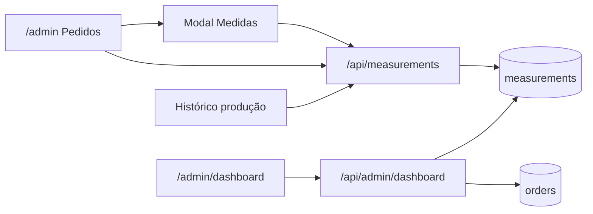

# Medidas gerenciáveis + Dashboard Admin

Documentação das melhorias no painel administrativo: persistência e CRUD de
**medidas** (metragem por quantidade), nova aba **Dashboard** com analytics de
pedidos finalizados, e renomeação da aba de pedidos.

---

## Objetivos atendidos

1. **Medidas no banco** (PostgreSQL), com seed a partir dos valores que estavam
   hardcoded em `app/admin/measurements.ts`.
2. **CRUD via UI** (modal na aba Pedidos), sem alterar o fluxo de pedidos.
3. **Listas de produção / histórico** passam a obter a metragem do banco.
4. **Nova aba Dashboard** (`/admin/dashboard`) com resumo do período, gráfico e
   rankings (quantidades, itens, clientes).
5. Aba antiga "Dashboard" renomeada para **Pedidos** (`/admin`), mantida como
   destino padrão após o login.

---

## Visão geral



---

## Banco de dados

### Tabela `measurements`

| Coluna         | Tipo           | Notas                                      |
| -------------- | -------------- | ------------------------------------------ |
| `id`           | UUID PK        | `gen_random_uuid()`                        |
| `quantity`     | INTEGER UNIQUE | Quantidade de unidades (> 0)               |
| `meters`       | NUMERIC(10,2)  | Metragem de tecido (≥ 0)                   |
| `observation`  | TEXT           | Opcional (ex.: `DINIZ` no seed)            |
| `created_at`   | TIMESTAMPTZ    |                                            |
| `updated_at`   | TIMESTAMPTZ    |                                            |

Índice parcial em `orders(finalized_at)` para consultas do dashboard.

### Migração / seed

Arquivo: [`scripts/measurements-migration.sql`](scripts/measurements-migration.sql)

```bash
psql "$DATABASE_URL" -f scripts/measurements-migration.sql
```

Também espelhado em `POST /api/init-db` (CREATE + `INSERT … ON CONFLICT DO NOTHING`).
O seed **não sobrescreve** medidas já editadas.

---

## APIs

### Medidas (auth admin)

| Método | Rota                      | Função        |
| ------ | ------------------------- | ------------- |
| GET    | `/api/measurements`       | Listar        |
| POST   | `/api/measurements`       | Criar         |
| PUT    | `/api/measurements/[id]`  | Atualizar     |
| DELETE | `/api/measurements/[id]`  | Excluir       |

### Dashboard (auth admin)

`GET /api/admin/dashboard`

Query params:

- `preset`: `this_month` | `last_month` | `last_3_months` | `custom`
- `from` / `to`: `YYYY-MM-DD` (obrigatórios se `custom`)
- `granularity`: `day` | `week` | `month` | `year`

Filtro: pedidos com `finalized_at` no período e `canceled_at IS NULL`.

Resposta inclui: `summary` (pedidos, itens, metragem, quantidades sem medida),
`series`, `topQuantities`, `topItems` (com URL de imagem quando disponível),
`topCustomers`.

**Metragem:** soma `meters` da medida cujo `quantity` = `quantity_purchased`
de cada pedido finalizado. Quantidades sem cadastro ficam de fora da soma e
aparecem no rodapé do card.

---

## UI Admin

| Rota                 | Aba        | Conteúdo                                                                 |
| -------------------- | ---------- | ------------------------------------------------------------------------ |
| `/admin/dashboard`   | Dashboard  | Filtros de período, cards, gráfico (recharts), tops com scroll           |
| `/admin`             | Pedidos    | Fluxo de pedidos + botão **Medidas** (modal CRUD)                        |
| `/admin/production-history` | Histórico | Listas usam mapa de medidas da API                              |

Top 50 itens: imagem ~77px, referência centralizada; clique abre modal com
imagem ampliada.

---

## Arquivos principais

| Arquivo | Papel |
| ------- | ----- |
| `scripts/measurements-migration.sql` | SQL de migração + seed |
| `app/api/init-db/route.ts` | CREATE/seed no init |
| `lib/database.ts` | CRUD medidas + agregações do dashboard |
| `app/api/measurements/*` | Rotas REST medidas |
| `app/api/admin/dashboard/route.ts` | API do dashboard |
| `app/admin/components/MeasurementsModal.tsx` | Modal CRUD |
| `app/admin/measurements.ts` | Helpers de formatação (`formatMeters`, `getMeasureLabel`) |
| `app/admin/dashboard/page.tsx` | Página do dashboard |
| `app/admin/layout.tsx` | Nav: Dashboard + Pedidos |
| `app/admin/page.tsx` / `production-history/page.tsx` | Listas com medidas do DB |
| `app/admin/login/page.tsx` | Redirect pós-login via `useEffect` (fix setState-in-render) |

---

## Garantias

- Rotas `/api/orders`, links, status, lotes e download **não** foram alteradas
  no fluxo de negócio.
- Se a API de medidas falhar, as listas usam `"N/A"` (mesmo fallback de antes).
- Login continua redirecionando para `/admin` (Pedidos).

---

## Checklist pós-deploy

- [ ] Rodar `scripts/measurements-migration.sql` no Postgres de produção (se ainda não rodou).
- [ ] CRUD de medidas no modal Pedidos.
- [ ] Copiar referências / tabela no fluxo de produção com metros do banco.
- [ ] Histórico de produção com as mesmas medidas.
- [ ] Dashboard: presets, custom, granularidades, metragem e aviso de qty faltantes.
- [ ] Smoke do fluxo de pedido (link → confirmar → produção → finalizar).
