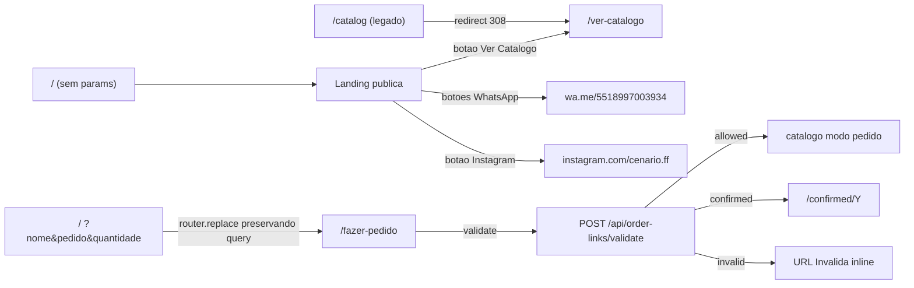

# Plano: Reorganizar rotas raiz e catálogo

> Status: aprovado, aguardando implementação.
>
> Objetivo: separar a raiz em duas responsabilidades (landing pública sem
> params, redirecionador com params), introduzir `/ver-catalogo`
> (visualização aberta a todos, mesmo para clientes em modo pedido) e
> `/fazer-pedido` (modo pedido completo, herdando o comportamento atual de
> `/catalog` com `customerData`). Manter `/catalog` como redirect 308 para
> `/ver-catalogo` para compatibilidade com links já compartilhados.

---

## Decisões de produto confirmadas

- **WhatsApp:** número hardcoded `5518997264861` em `lib/whatsapp.ts` (helper único).
- **`/catalog` legado:** vira redirect 308 para `/ver-catalogo`.

---

## Mapa de rotas (depois)



---

## 1. Componente compartilhado de catálogo

Estratégia de intervenção mínima sem duplicar a UI grande de
[app/catalog/page.tsx](app/catalog/page.tsx):

- Mover `app/catalog/page.tsx` (~1130 linhas) para
  `components/catalog/CatalogView.tsx` como **componente cliente** que
  aceita uma prop `mode: 'order' | 'view'`.
- A detecção atual de modo (presença de `customerData` no localStorage)
  passa a respeitar a prop:
  - `mode='view'`: ignora `customerData`, **força** modo visualização. Não
    carrega/escreve `selectedImages:{orderNumber}`, não inicia cronômetro,
    não faz background validation, não mostra botão de confirmar.
  - `mode='order'`: comportamento atual idêntico ao `/catalog` quando há
    `customerData`. Se `customerData` estiver ausente, redireciona para
    `/` (atalho de segurança).
- Onde antes era `customerData !== null` para decidir o modo, passa a ser:

  ```ts
  const isOrderMode = mode === "order" && customerData !== null
  ```

- Background validation (`POST /api/order-links/validate`) e POST de
  pedido (`POST /api/orders`) ficam guardados por `isOrderMode`.

---

## 2. Rotas novas

### 2.1 `app/ver-catalogo/page.tsx` (novo)

```tsx
"use client"
import CatalogView from "@/components/catalog/CatalogView"

export default function Page() {
  return <CatalogView mode="view" />
}
```

### 2.2 `app/fazer-pedido/page.tsx` (novo)

Absorve a validação que hoje vive em `app/page.tsx`:

- Lê `nome` / `pedido` / `quantidade` via `useSearchParams`.
- Sem params válidos: redireciona para `/`.
- Com params válidos:
  - Reusa toda a lógica de hidratação de `localStorage.customerData` +
    `sessionLocked` + limpeza das chaves do pedido anterior (copiada de
    `app/page.tsx` ~47–70).
  - Faz `POST /api/order-links/validate`. Trata os mesmos resultados que
    a raiz hoje:
    - `allowed` → grava `customerData` e renderiza
      `<CatalogView mode="order" />`.
    - `confirmed` → `router.replace('/confirmed/...')`.
    - `invalid` / `network` → renderiza inline a tela "URL Inválida"
      (mesmo Card que hoje vive em `app/page.tsx` ~93–112).

### 2.3 `app/catalog/page.tsx` (vira redirect)

Substituir o conteúdo por um server component:

```tsx
import { redirect } from "next/navigation"

export default function Page() {
  redirect("/ver-catalogo")
}
```

Cobre bookmarks e qualquer link antigo. Fora isso, `/catalog` deixa de
receber tráfego (todos os emissores internos são atualizados — ver §6).

---

## 3. Nova landing em `app/page.tsx`

Reescrita inteira. Estrutura:

- Wrapper com `useSearchParams`. Se houver params válidos
  (`nome` e `pedido` e `quantidade > 0`), faz `router.replace` para
  `/fazer-pedido?<mesma query>` ainda no `useEffect` inicial e renderiza
  um spinner. Se não, renderiza a landing.
- Layout: navbar com `` à esquerda + `<main>` com
  container `max-w-md mx-auto px-4 py-8 space-y-10` centralizado.
- Cada seção é um bloco com título, opcional descrição, e botão
  `Button className="w-full"` (Shadcn) ou `<a>` estilizado:
  1. **"Mini Painéis Redondos 50cm"** + Button "Ver Catálogo" →
     `<Link href="/ver-catalogo">`.
  2. **"Painéis Sublimados Sob Medida"** + descrição + Button
     "Orçamento por WhatsApp" → `<a href={buildWhatsAppLink('Olá,
     gostaria de fazer um orçamento de painéis sublimados.')}
     target="_blank" rel="noopener noreferrer">`.
  3. **"Grupo VIP para decoradores"** + "Queima de estoque todo mês" +
     Button "Quero entrar no Grupo VIP" → `<a target="_blank" ...>` com
     mensagem "Olá, quero entrar no Grupo VIP para decoradores.".
  4. **"Siga a Cenario no Instagram"** +
     `<a href="https://www.instagram.com/cenario.ff" target="_blank"
     rel="noopener noreferrer">` envolvendo
     ``.

---

## 4. Helper de WhatsApp

Novo `lib/whatsapp.ts`:

```ts
export const WHATSAPP_NUMBER = "5518997003934"

export function buildWhatsAppLink(message: string): string {
  const text = encodeURIComponent(message)
  return `https://wa.me/${WHATSAPP_NUMBER}?text=${text}`
}
```

Mantém o número num único lugar; trocar depois é trivial.

---

## 5. Asset do Instagram

A imagem foi salva em
`.cursor/.../assets/perfil-social-49413930-761c-4b9e-bd12-8c23642a9f5c.png`.
Será copiada para `public/perfil-social.png` (mesmo padrão de
`public/logo.png`). Sem criar `public/images/`, para seguir a convenção
atual.

---

## 6. Atualizar referências internas a `/catalog`

São 3 lugares que linkam para a antiga `/catalog`. Atualizar para a rota
correta:

- [app/orders/[username]/page.tsx](app/orders/[username]/page.tsx) L104
  (`router.push("/catalog")` no botão "Ver catálogo"): trocar para
  `/ver-catalogo`.
- `components/catalog/CatalogView.tsx` (após mudança) L722
  (`router.push("/catalog")` no botão "Limpar busca"): trocar para
  `router.push(pathname)` (recarrega a mesma rota sem query, funciona em
  ambos os modos).
- `app/catalog/page.tsx`: vira redirect server-side (§2 já cobre).

Background validation em modo pedido (`router.replace("/")` em L290):
mantém — a raiz sem params agora vai cair na landing, comportamento
desejado para "URL inválida em background".

---

## 7. O que NÃO muda

- `lib/order-links.ts` continua gerando
  `${origin}/?nome=...&pedido=...&quantidade=...` (a raiz). A raiz
  redireciona para `/fazer-pedido`, então **todas as URLs já enviadas a
  clientes continuam funcionando**, com 1 redirect a mais transparente.
- `app/admin/links/page.tsx` (preview de URL) idem — sem mudança.
- `app/api/order-links/validate`, `app/api/orders`,
  `app/api/order-links/...`, `app/admin/...`, `app/confirmed/...`,
  `app/orders/...`: nenhuma alteração.
- Comportamento do modo pedido (cronômetro, persistência por
  `orderNumber`, validação em background, propagação de cancelamento,
  restrição/auto-registro): preservado integralmente porque o componente
  é o mesmo, só extraído.

---

## 8. Riscos e mitigações

- **Extrair `app/catalog/page.tsx` é a única edição estrutural
  significativa.** Mitigação: a extração é mecânica (mover o arquivo
  para `components/catalog/CatalogView.tsx`, exportar como default,
  adicionar prop `mode` com default `'order'`). Diff focado, sem refator
  de lógica interna.
- **Hidratação de localStorage em `/fazer-pedido`**: copiar fielmente o
  trecho de `app/page.tsx` ~47–70 (limpeza condicional de
  `selectedImages:{old}`, `catalogTimer:{old}`, `imageCache:{old}`
  quando o `orderNumber` muda).
- **Cliente em pedido tenta abrir `/ver-catalogo`**: hoje, com
  `customerData` no LS, ele veria o cabeçalho "Olá, fulano!" e seria
  forçado a confirmar. Com a flag `mode='view'`, ele vê o cabeçalho
  "Modo de Visualização" e nada mais. Sem efeitos colaterais (não mexe
  no `customerData`, não dispara validate, não inicia timer).
- **Race do redirect na raiz com params**: como o `useEffect` roda só
  client-side, durante o primeiro paint mostramos um spinner curto.
  Sem flash de conteúdo da landing.
- **`/catalog` legado**: redirect 308 é cacheável pelo browser.
  Bookmarks caem direto em `/ver-catalogo`. Sem flash.

---

## 9. Áreas afetadas

**Editados:**

- [app/page.tsx](app/page.tsx) — reescrita: landing + redirect.
- [app/catalog/page.tsx](app/catalog/page.tsx) — vira redirect server.
- [app/orders/[username]/page.tsx](app/orders/[username]/page.tsx) —
  botão "Ver catálogo" → `/ver-catalogo`.

**Movidos:**

- `app/catalog/page.tsx` (lógica) → `components/catalog/CatalogView.tsx`
  (com prop `mode`).

**Novos:**

- `app/ver-catalogo/page.tsx`
- `app/fazer-pedido/page.tsx`
- `lib/whatsapp.ts`
- `public/perfil-social.png` (cópia do asset)

**Não tocados:**

- Toda a stack de API e admin.
- `lib/order-links.ts`, `app/admin/links/page.tsx` (URLs continuam
  apontando para a raiz; a raiz redireciona).
- `app/confirmed/[orderNumber]/page.tsx`.

---

## 10. Testes manuais sugeridos

1. Acessar `/` direto: vê a landing com 4 seções. Botão "Ver Catálogo"
   leva a `/ver-catalogo`.
2. Botão "Orçamento por WhatsApp" abre nova aba em
   `wa.me/5518997003934?text=...` com mensagem pré-preenchida.
3. Botão "Quero entrar no Grupo VIP" idem com a mensagem do VIP.
4. Imagem do Instagram com hover (escala 105%) e clique em nova aba para
   `instagram.com/cenario.ff`.
5. Acessar `/?nome=X&pedido=Y&quantidade=Z` (link `pending`): vê
   spinner, redireciona para `/fazer-pedido?...`, valida, entra em modo
   pedido. Selecionar e confirmar → `/confirmed/Y`.
6. Acessar `/?...` com link `confirmed`: redireciona para
   `/fazer-pedido`, valida e redireciona para `/confirmed/Y`.
7. Acessar `/?...` com link inválido/cancelado: vê tela "URL Inválida"
   inline em `/fazer-pedido`.
8. Cliente em modo pedido (com `customerData` no LS) abre
   `/ver-catalogo`: vê o catálogo em modo visualização, **não é
   expulso**, pode buscar livremente.
9. Acessar `/catalog`: redirecionado (308) para `/ver-catalogo`.
10. Em `/orders/{username}`, clicar em "Ver catálogo" leva a
    `/ver-catalogo`.
11. Em `/fazer-pedido`, durante o catálogo, "Limpar busca" recarrega a
    mesma rota.
12. Validação em background no modo pedido: forçar
    `localStorage.customerData` para um pedido confirmado e abrir
    `/fazer-pedido`: redireciona para `/confirmed/Y`.

---

## 11. Checklist de implementação

- [ ] **extract_catalog** — Mover `app/catalog/page.tsx` para
  `components/catalog/CatalogView.tsx`, adicionar prop
  `mode: 'order' | 'view'` que sobrepõe a detecção por `customerData`.
- [ ] **route_view** — Criar `app/ver-catalogo/page.tsx` renderizando
  `<CatalogView mode='view' />`.
- [ ] **route_order** — Criar `app/fazer-pedido/page.tsx` absorvendo a
  validação de `app/page.tsx` atual (validate + customerData + tela
  "URL Inválida") e renderizando `<CatalogView mode='order' />` quando
  `allowed`.
- [ ] **route_legacy** — Substituir `app/catalog/page.tsx` por server
  component que faz `redirect("/ver-catalogo")`.
- [ ] **wa_helper** — Criar `lib/whatsapp.ts` com
  `WHATSAPP_NUMBER='5518997003934'` e `buildWhatsAppLink(msg)`.
- [ ] **asset** — Copiar imagem do Instagram para
  `public/perfil-social.png`.
- [ ] **landing** — Reescrever `app/page.tsx`: redirect para
  `/fazer-pedido` quando há params; senão renderiza landing (logo, 4
  seções com CTAs, imagem do Instagram com hover).
- [ ] **refs** — Atualizar referências internas a `/catalog` em
  `app/orders/[username]/page.tsx` (→ `/ver-catalogo`) e no botão
  "Limpar busca" do `CatalogView` (→ usar `pathname` atual).
- [ ] **qa** — Validar manualmente os 12 cenários da §10.
