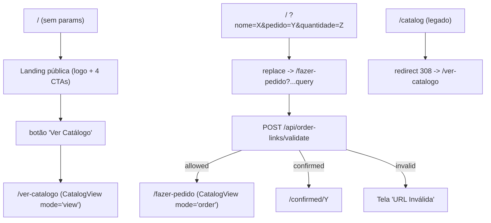

# Rotas e Landing — Refatoração

Este documento descreve a reorganização do front realizada para tornar mais claro
o papel de cada rota do catálogo e introduzir uma landing pública com CTAs
relevantes (catálogo, WhatsApp, Grupo VIP, Instagram).

Complementa o documento [`LINKS-PEDIDOS-REFACTOR.md`](./LINKS-PEDIDOS-REFACTOR.md):
o backend (links registrados, validação, cancelamento, auto-registro etc.) **não
muda**. O que mudou aqui é o front — quais rotas existem, o que cada uma faz e
como o catálogo é renderizado em cada contexto.

---

## Objetivos atendidos

1. **Nomenclatura clara**: separar visualização (`/ver-catalogo`) de pedido
   (`/fazer-pedido`). Não há mais ambiguidade sobre o "modo" do catálogo.
2. **Cliente com pedido em andamento pode visualizar o catálogo** sem perder o
   carrinho/identificação. Antes, o `/catalog` abria automaticamente em modo
   pedido se houvesse `customerData` no `localStorage`.
3. **Landing pública na raiz** com 4 CTAs: ver catálogo, orçamento por
   WhatsApp, entrar no Grupo VIP, seguir no Instagram.
4. **Compatibilidade total** com links já distribuídos
   (`/?nome=X&pedido=Y&quantidade=Z` continua funcionando) e com bookmarks
   antigos para `/catalog`.

---

## Mapa de rotas



### Tabela de URLs (após esta refatoração)

| URL acessada                                         | Resultado                                                                                                  |
| ---------------------------------------------------- | ---------------------------------------------------------------------------------------------------------- |
| `/`                                                  | Landing pública (logo + 4 CTAs).                                                                           |
| `/?nome=X&pedido=Y&quantidade=Z`                     | Redireciona para `/fazer-pedido?...` preservando a query original.                                         |
| `/fazer-pedido?...` válido + link `pending`          | Renderiza catálogo em modo pedido (carrinho do `orderNumber` é restaurado).                                |
| `/fazer-pedido?...` com link `confirmed`             | Redireciona para `/confirmed/Y`.                                                                           |
| `/fazer-pedido?...` com link `cancelled` ou inválido | Tela "URL Inválida".                                                                                       |
| `/fazer-pedido` sem nenhum param                     | Volta para `/` (não faz sentido fazer pedido sem identificação).                                           |
| `/ver-catalogo`                                      | Catálogo em modo visualização puro. **Aberto a todos**, inclusive clientes com pedido em andamento.        |
| `/catalog` (legado)                                  | `redirect("/ver-catalogo")` server-side (308 automático).                                                  |
| `/confirmed/Y`                                       | Inalterado.                                                                                                |
| `/orders/{username}`                                 | Inalterado, exceto botão "Voltar ao catálogo" agora aponta para `/ver-catalogo`.                           |

---

## Componente compartilhado `CatalogView`

A página `app/catalog/page.tsx` foi extraída para
`components/catalog/CatalogView.tsx`. Isso evita duplicação entre as duas
rotas que renderizam o catálogo (`/ver-catalogo` e `/fazer-pedido`).

### Assinatura

```ts
type CatalogViewProps = {
  mode?: "order" | "view"   // default: "order" (preserva consumidores legados)
}
```

### Comportamento por modo

| Aspecto                                  | `mode="order"`                                       | `mode="view"`                                                |
| ---------------------------------------- | ---------------------------------------------------- | ------------------------------------------------------------ |
| Hidrata `customerData` do `localStorage` | Sim                                                  | **Não** (ignora mesmo se existir)                            |
| Header                                   | "Olá, {nome}!" + badge `N/M selecionadas`            | "Modo de Visualização"                                       |
| Cronômetro de 2h por pedido              | Sim (chave `catalogTimer:{orderNumber}`)             | Não                                                          |
| Validação em background do link          | Sim (`POST /api/order-links/validate`)               | Não                                                          |
| Persistência da seleção                  | Sim (chave `selectedImages:{orderNumber}`)           | Não persiste (não há seleção)                                |
| Cliques nos cards selecionam imagem      | Sim                                                  | Não (`cursor-default`, `onClick` ignora sem `customerData`)  |
| Modal "Confirmar Pedido" + botão CTA     | Sim                                                  | Não (botão só aparece quando há `customerData`)              |
| **Busca de temas (input + debounce)**    | **Sim** (mesma UX, mesmo debounce de 600ms)          | **Sim** (idêntica)                                           |
| Listagem de tendências                   | Sim                                                  | Sim                                                          |
| Scroll infinito                          | Sim                                                  | Sim                                                          |

> **Importante sobre a busca**: a busca de temas funciona **igual** nos dois
> modos — mesmo input fixo no header, mesmo debounce, mesmo endpoint
> (`GET /api/public-catalog?search=...`), mesma renderização de "Nenhum
> resultado encontrado". A diferença é puramente sobre **ações de seleção**:
> em `view`, clicar num card não seleciona, mas a busca, navegação,
> tendências, paginação e visualização das imagens permanecem inalteradas.

### Botão "Voltar ao Início" da tela de erro

O fallback de erro do catálogo agora usa `usePathname()` em vez do hardcoded
`/catalog`. Isso significa:

- Em `/ver-catalogo`, o botão recarrega a própria visualização.
- Em `/fazer-pedido`, recarrega a própria rota de pedido (preservando a query).

---

## Rotas novas

### `app/ver-catalogo/page.tsx`

Componente client mínimo:

```tsx
"use client"
import CatalogView from "@/components/catalog/CatalogView"
export default function VerCatalogoPage() {
  return <CatalogView mode="view" />
}
```

Acesso aberto a qualquer um. Mesmo um cliente com `customerData` no
`localStorage` (pedido em andamento) abre essa rota em modo visualização puro
— **sem perder** o `customerData`/`selectedImages:{orderNumber}` armazenados.
O carrinho está esperando intacto quando ele voltar ao link de pedido.

### `app/fazer-pedido/page.tsx`

Absorveu integralmente a lógica que antes vivia em `app/page.tsx`:

1. Lê `nome`, `pedido`, `quantidade` da query.
2. Sem nenhum param → `router.replace("/")` (volta à landing).
3. Params malformados → tela "URL Inválida".
4. `POST /api/order-links/validate`:
   - `allowed` → grava `customerData` + `sessionLocked` no `localStorage`,
     limpa carrinho de pedido anterior se mudou de link, renderiza
     `<CatalogView mode="order" />`.
   - `confirmed` → `router.replace("/confirmed/Y")`.
   - `invalid` → tela "URL Inválida" inline.
   - falha de rede → tela "URL Inválida" com `reason: 'network'`.

### `app/catalog/page.tsx` (server)

Reduzida a um redirect permanente:

```tsx
import { redirect } from "next/navigation"
export default function CatalogLegacyPage() {
  redirect("/ver-catalogo")
}
```

Garante que qualquer link, bookmark ou doc apontando para `/catalog` continue
funcional, agora caindo na visualização.

---

## Landing pública (`app/page.tsx`)

### Lógica

- Sem params: renderiza a landing.
- Com qualquer um dos params (`nome`/`pedido`/`quantidade`): `router.replace`
  para `/fazer-pedido?` + query original. **Toda a validação/UX de pedido
  acontece em `/fazer-pedido`** — a raiz é só um redirector quando há intenção
  de pedido.

### Layout

- Container vertical em altura cheia: `flex h-screen flex-col bg-gray-50`.
- **Header fixo** (`shrink-0`): logo `/logo.png` (120px) centralizada.
- **Main rolável** (`flex-1 overflow-y-auto`): 4 seções, container
  `max-w-lg mx-auto px-4 py-8 space-y-10`.
- **Footer fixo** (`shrink-0`):
  - **Cenario | Birigui-SP** (negrito)
  - 42.480.518/0001-10

### Seções

| Seção           | Título / texto                                                                | CTA                            | Ícone           |
| --------------- | ----------------------------------------------------------------------------- | ------------------------------ | --------------- |
| 1. Catálogo     | **Mini Painéis Redondos** + "Confira nosso catálogo de Mini Painéis Redondos 50cm" | `Ver Catálogo` → `/ver-catalogo` | `Images`        |
| 2. Sublimados   | **Painéis e Pisos Sublimados Sob Medida** + "🇧🇷 Enviamos para todo o Brasil." | `Orçamento por WhatsApp` (nova guia) | `MessageCircle` |
| 3. Grupo VIP    | **Entre no Grupo VIP para Decoradores** + "Promoções Exclusivas e Queimas de Estoque todo os meses. 🔥" | `Quero entrar no Grupo VIP` (nova guia) | `Crown`         |
| 4. Instagram    | **Siga a Cenario no Instagram**                                               | Imagem clicável (``) → [@cenario.ff](https://www.instagram.com/cenario.ff) | —               |

### Botões

Todos seguem o mesmo estilo:

- `size="lg"` (variant default — sem `outline`).
- Wrapper `block w-full max-w-[350px] mx-auto` (limita a 350px e centraliza).
- Classe do botão: `w-full text-base font-medium uppercase`.
  - `text-base` (16px) = "fonte média".
  - `font-medium` = peso intermediário.
  - `uppercase` = caixa alta.

### Imagem do Instagram

`` em `<a target="_blank" rel="noopener noreferrer">` para
[@cenario.ff](https://www.instagram.com/cenario.ff):

- Dimensão: `block w-[70%] max-w-[300px] mx-auto`.
- Estilo: `rounded-2xl shadow-lg`.
- Hover: `transition-transform duration-200 hover:scale-105`.

---

## Helper WhatsApp (`lib/whatsapp.ts`)

Centraliza os números e a montagem do link `wa.me`:

```ts
export const WHATSAPP_NUMBERS = {
  orcamento: "5518997264861", // linha de orçamento de painéis sublimados
  vip:       "5518997003934", // linha do Grupo VIP para decoradores
} as const

// compatibilidade — número padrão historicamente usado
export const WHATSAPP_NUMBER = WHATSAPP_NUMBERS.vip

export function buildWhatsAppLink(
  message: string,
  number: string = WHATSAPP_NUMBERS.vip,
): string {
  const text = encodeURIComponent(message)
  return `https://wa.me/${number}?text=${text}`
}
```

Mensagens fixadas em `app/page.tsx`:

- Orçamento: `"Olá, gostaria de fazer um orçamento de painéis sublimados."`
- Grupo VIP: `"Olá, quero entrar no Grupo VIP para decoradores."`

---

## Asset

- `public/perfil-social.png` (≈103 KB) — usado na seção do Instagram.

---

## Referências internas atualizadas

- `app/orders/[username]/page.tsx`: botão "Voltar ao catálogo" agora aponta
  para `/ver-catalogo` em vez de `/catalog`.
- `lib/order-links.ts`: docstring de `buildClientOrderLink` atualizada para
  refletir o novo fluxo (raiz → `/fazer-pedido`). O **formato dos links
  gerados continua o mesmo**: `https://catalogo.lojacenario.com.br/?nome=...&pedido=...&quantidade=...`.

---

## Comportamento da busca — antes vs depois

A funcionalidade de busca (input fixo no header do catálogo + debounce de
600ms + chamada a `GET /api/public-catalog?search=...`) **não mudou em si**.
O que mudou é onde ela está disponível e em que modo:

| Cenário                                                                                     | Antes                                                          | Depois                                                                                              |
| ------------------------------------------------------------------------------------------- | -------------------------------------------------------------- | --------------------------------------------------------------------------------------------------- |
| Cliente sem `customerData` busca por um tema                                                | Funciona em `/catalog` (modo visualização)                     | Funciona em `/ver-catalogo` (idêntico)                                                              |
| Cliente em modo pedido (com `customerData`) busca por um tema                               | Funciona em `/catalog` (modo pedido)                           | Funciona em `/fazer-pedido` (idêntico)                                                              |
| Cliente **com pedido em andamento** quer apenas ver o catálogo / fazer buscas               | **Não era possível**: `/catalog` abria em modo pedido          | **Possível**: acessa `/ver-catalogo`. Busca, navega e visualiza sem afetar carrinho/timer/customer  |
| Resultado vazio                                                                             | Mensagem "Nenhum resultado encontrado para sua busca."         | Idêntica nos dois modos                                                                             |
| Tendências                                                                                  | Aparecem quando `searchQuery` está vazio                       | Idêntico nos dois modos                                                                             |
| Botão "Voltar ao Início" do fallback de erro                                                | Hardcoded para `/catalog`                                      | Usa `usePathname()` — recarrega a rota atual                                                        |

---

## O que **não** mudou

- Backend de `order_links` / `app_settings` / `orders`.
- API routes (`/api/order-links*`, `/api/orders*`, `/api/settings/*`,
  `/api/public-catalog`, `/api/catalog/trends`, validação, cancelamento,
  auto-registro).
- Painel admin (`/admin/*`), incluindo `/admin/links`.
- Página `/confirmed/[orderNumber]` e a lista `/orders/[username]` (exceto
  o destino do botão "Voltar ao catálogo").
- Schema do banco — nenhuma migração necessária.
- Formato dos links gerados em `/admin/links`
  (`https://catalogo.lojacenario.com.br/?nome=...&pedido=...&quantidade=...`).
  O redirect interno para `/fazer-pedido` é transparente para o cliente.
- Estrutura das chaves de `localStorage` por pedido
  (`selectedImages:{orderNumber}`, `catalogTimer:{orderNumber}`,
  `imageCache:{orderNumber}`, `justConfirmed:{orderNumber}`).

---

## Áreas afetadas (arquivos)

### Novos

- `components/catalog/CatalogView.tsx` — componente compartilhado.
- `app/ver-catalogo/page.tsx` — rota de visualização.
- `app/fazer-pedido/page.tsx` — rota de pedido (com validação).
- `lib/whatsapp.ts` — números + helper.
- `public/perfil-social.png` — imagem do Instagram.

### Editados

- `app/page.tsx` — virou landing pública + redirector.
- `app/catalog/page.tsx` — virou redirect server-side para `/ver-catalogo`.
- `app/orders/[username]/page.tsx` — botão "Voltar ao catálogo" → `/ver-catalogo`.
- `lib/order-links.ts` — docstring atualizada.

### Não tocados (relevantes)

- `app/api/**` (todo o backend).
- `app/admin/**`.
- `app/confirmed/**`.
- `lib/database.ts`, `lib/order-links.ts` (apenas docstring).
- Componentes UI (`components/ui/**`).

---

## Compatibilidade

- **Links já distribuídos** (`https://catalogo.lojacenario.com.br/?nome=...&pedido=...&quantidade=...`)
  continuam funcionando: a raiz detecta os params e redireciona para
  `/fazer-pedido?...`. A validação contra `order_links` (incluindo as flags
  `catalog_access_restricted` e `auto_register_links_on_confirm`) acontece
  exatamente como antes.
- **Bookmarks/marcadores em `/catalog`** continuam funcionando: 308 server
  redirect para `/ver-catalogo`.
- **Clientes com `customerData` em andamento** continuam abrindo o catálogo
  em modo pedido pelo link original; ganham a opção extra de visualizar o
  catálogo via `/ver-catalogo` sem interromper a sessão.
- **Hosts atrás de sub-path** (`NEXT_PUBLIC_BASE_PATH=/catalogointerativo`):
  `lib/order-links.ts` continua usando `extractOrigin()` para gerar links no
  domínio raiz; nada muda na geração.

---

## QA recomendado

1. `/` sem params → landing renderiza (logo no topo, footer com CNPJ visível,
   conteúdo rolável entre eles).
2. `/?nome=X&pedido=Y&quantidade=N` válido → redirect para `/fazer-pedido?...`
   → catálogo em modo pedido com `customerData` hidratado e badge `0/N`.
3. `/?nome=X&pedido=Y&quantidade=N` malformado → `/fazer-pedido` mostra
   tela "URL Inválida".
4. `/?nome=X&pedido=Y&quantidade=N` já confirmado → `/fazer-pedido` redireciona
   a `/confirmed/Y`.
5. `/ver-catalogo` para usuário **sem** customerData → header "Modo de
   Visualização", sem cronômetro, cliques em cards não selecionam.
6. `/ver-catalogo` para usuário **com** customerData (pedido em andamento)
   → mesma experiência de visualização (não consegue selecionar/confirmar)
   — `customerData`/`selectedImages:{orderNumber}` permanecem intactos.
   Ao reabrir o link de pedido, o carrinho continua lá.
7. `/fazer-pedido` direto sem params → redireciona pra `/`.
8. Confirmação de pedido em `/fazer-pedido` → POST `/api/orders` → toast →
   `/confirmed/{pedido}` (sem banner "já confirmado" na primeira visita).
9. `/catalog` (rota legada) → 308 → `/ver-catalogo`.
10. Botão "Voltar ao catálogo" em `/orders/{username}` → vai para `/ver-catalogo`.
11. CTA "Orçamento por WhatsApp" → abre `wa.me/5518997264861?text=...` em nova aba.
12. CTA "Quero entrar no Grupo VIP" → abre `wa.me/5518997003934?text=...` em nova aba.
13. CTA "Ver Catálogo" → vai para `/ver-catalogo` na mesma aba.
14. Imagem do Instagram → abre `instagram.com/cenario.ff` em nova aba; hover
    aplica `scale-105`.
15. **Busca**: digitar termo em `/ver-catalogo` filtra normalmente; mesmo
    termo em `/fazer-pedido` retorna o mesmo resultado e permite seleção.
16. Botão "Voltar ao Início" do fallback de erro do catálogo → recarrega a
    rota atual (não navega para `/catalog`).
